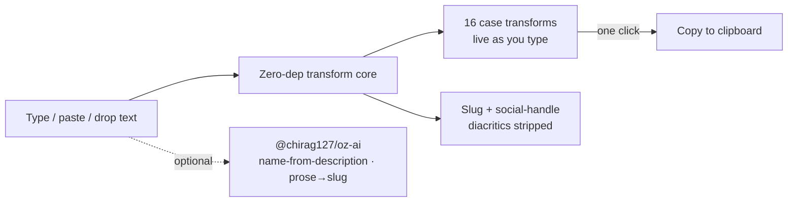

# oriz-case

> Case & format converter for devs and writers — one box in, every case out. 100% client-side.

[](./LICENSE)
[](https://github.com/chirag127/oriz-case/stargazers)
[](https://github.com/chirag127/oriz-case/commits/main)
[](https://astro.build)
[](https://case.oriz.in)

- **Live app:** https://case.oriz.in _(canonical — Cloudflare Pages)_
- **About / info:** https://chirag127.github.io/oriz-case/ _(GitHub Pages landing)_
- **Repo:** https://github.com/chirag127/oriz-case
- **For AI/agents:** https://case.oriz.in/llms.txt

Case & format converter for devs and writers. One box in, every case out —
camelCase, PascalCase, snake_case, CONSTANT_CASE, kebab-case, COBOL-CASE,
dot.case, path/case, Title Case, Sentence case + more.
**100% client-side — no upload, no signup, no tracking, free.**

**⭐ If this is useful, please [star the repo](https://github.com/chirag127/oriz-case/stargazers) — it helps others find it.**

## How it works



## What it does

- 16 case transforms, live as you type, copy any with one click.
- Per-line or whole-block conversion for lists of identifiers.
- Drag-drop or pick a text file (`.txt/.md/.csv/.json/.js/.ts/.py`).
- Slug + social-handle generators (diacritics stripped).
- Optional AI: suggest a variable/function name from a description, or turn
  prose into a clean URL slug. Powered by [`@chirag127/oz-ai`](https://github.com/chirag127/design-system)
  (g4f multi-provider failover, no key). AI is polish only — the converter works
  fully offline if every provider is down.

## Privacy

Everything runs in your browser. Text never leaves the page — no server, no API
key, no analytics. The only network call is the optional AI feature, which you
trigger explicitly.

## Tech

Astro (static) · React 19 islands · Tailwind v4 · zero-dep transform core ·
PWA-installable · shared `@chirag127/oz-*` packages for chrome, tokens, files, AI.

## Develop

```sh
npm install --legacy-peer-deps
npm run dev      # local
npm test         # vitest — pure transform logic
npm run build    # static dist/
npm run deploy   # Cloudflare Pages
```

## Part of the oriz family

One of ~80 small, fast, single-purpose tools and sites in the **oriz** fleet — see [blog.oriz.in](https://blog.oriz.in) for how it's built and run solo. Sibling tools: [json.oriz.in](https://json.oriz.in) · [name.oriz.in](https://name.oriz.in) · [diagram.oriz.in](https://diagram.oriz.in) · [resume.oriz.in](https://resume.oriz.in).

**Cost:** $0 — static build hosted free on Cloudflare Pages; AI is keyless (g4f) and client-side.

## Contributing

Issues and PRs welcome. Conventional commits are the changelog.

## Author

Chirag Singhal · chirag@oriz.in

## Status

Stable.

## License

MIT © 2026 Chirag Singhal
